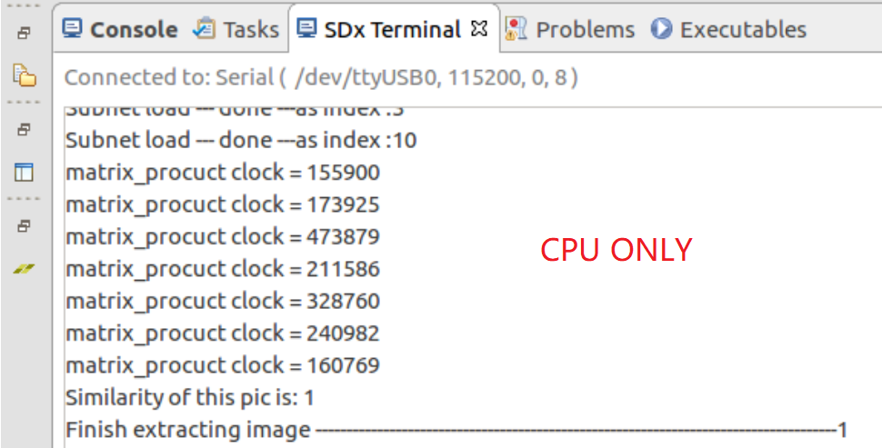
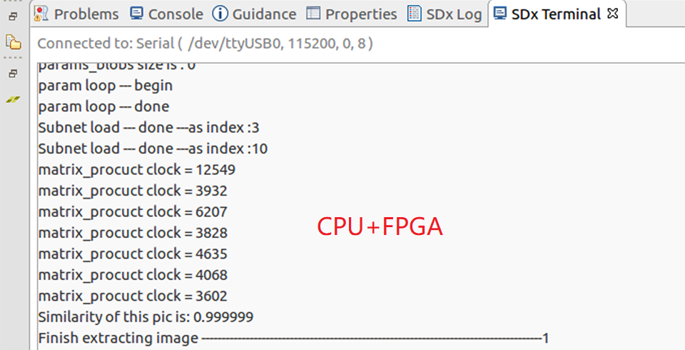
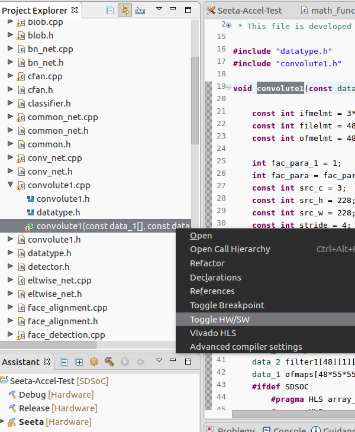
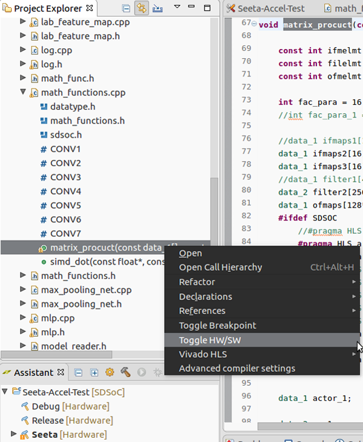
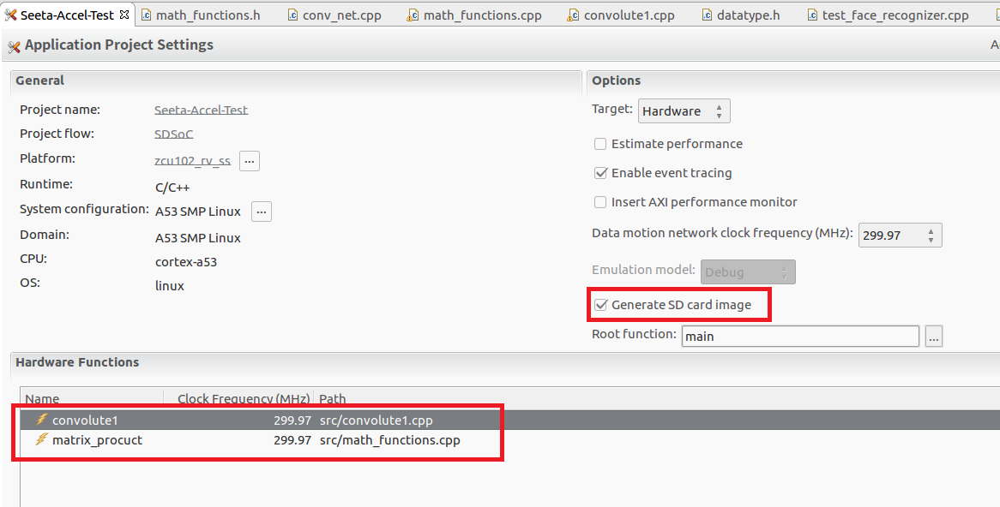
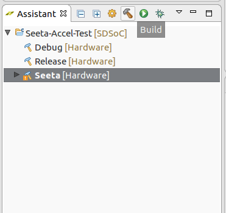
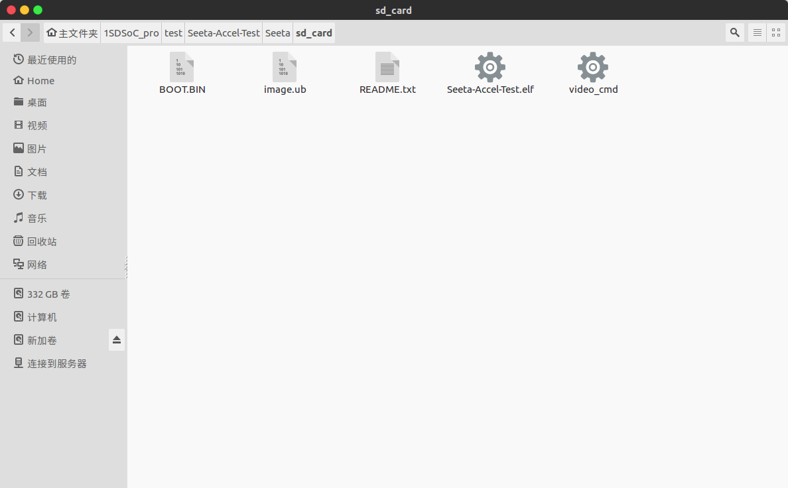

# \<Super Detailed Tutorial\> Accelerate CNN computation with FPGA

查看中文版教程请戳 [**这里**](./README_CN.md) ,更详细哦！

This is an original tutorial, please indicate the source when it is reprinted : <https://github.com/WalkerLau>

The purpose of this project is to accelerate the processing speed of convolution neural network with the help of FPGA, which shows great advantage on parallel computation. It's also my bachelor graduation project, and I am glad to show you how my work is done step by step.   

## Final Performance 
Let's first check out how fast our FPGA accelerator can achieve. The acceleration system only accelerates convolution layers. The screenshots below indicate the processing clock cycles on two cases where we implement our FPGA accelerator on convolution layers or not. VIPLFaceNet, a face recognition algorithm with 7 convolution layers, is adopted as an evaluation application for this project. Compared with using only a quad-core ARM Cortex A53 CPU, this CPU+FPGA acceleration system works 45x-75x faster on VIPLFaceNet.  

    

## Description & Features

VIPLFaceNet, as mentioned above, is part of [SeetaFaceEngine](https://github.com/seetaface/SeetaFaceEngine) which is an open source face recognition engine developed by Visual Information Processing and Learning (VIPL) group, Institute of Computing Technology, Chinese Academy of Sciences.  

This project is developed on Xilinx SDSOC. It is a very efficient embedded development tool for individual developers or small teams. With the help of SDSOC, you can program your FPGA hardware even with little knowledge about HDL. 

Below are some features of the acceleration system:

* **Easy Transplantation**. SDSOC automatically translates C/C++ to HDL and then creates FPGA bitstream. So, you can easily migrate this system to other CNN algorithms, especially to those written in C/C++, by just adjusting the accelerator structure ( such as ifmap size, stride, filter size, etc) which can be seen inside my source code so that it can fit in different convolution layers. 
  
* **Good Performance**. This acceleration system includes a bunch of optimization strategies as listed below. 
  
  * ifmap volume reuse architecture
  
  * convert data to lower precision  
  
  * 16-channel parallel processing unit & adder tree
  
  * pipline
  
  * on-chip BRAM partition & BRAM's cross-layer sharing  
  
  * multi-layer acceleration strategy 
  
## What should I prepare before getting started?

* Hardware
  * Xilinx Ultrascale+ MPSOC ZCU102 ( also works on ZCU104 or other Xilinx devices, depending on your performance needs )
  
* Software
  * Ubuntu 16.04 ( For installing and running SDSOC. The acceleration system requires an embedded Linux OS, which means all development work should be done on a Linux host machine and under Linux environment )
  
  * Xilinx SDSOC 2018.2 ( click -> [SDSOC installation and configuration tutorial (Chinese)](http://blog.eetop.cn/blog-1674693-6943425.html?_dsign=c2e07c0d). It's important to properly install and configure SDSOC before further operations, so it's strongly recommended to glance over Xilinx's official document [UG1294](https://www.xilinx.com/support/documentation/sw_manuals/xilinx2018_2/ug1294-sdsoc-rnil.pdf)   )

  * Xilinx reVISION platform ( The main reason for installing reVISION platform is to use xfopencv library, as SeetaFace uses OpenCV to load and preprocess images. For more information about reVISION platform and xfopencv configuration, please check [reVISION-Getting-Started-Guide](https://github.com/Xilinx/reVISION-Getting-Started-Guide) and [xfopencv tutorial](https://github.com/Xilinx/SDSoC-Tutorials/blob/2018.2-Tutorials/opencv-to-xfopencv-migration-tutorial/lab2-build-sdsoc-acceleration-project.md) )
  
  * [ optional, but recommended ] CodeBlocks ( for off-board debugging )

  * [ optional, but recommended ] OpenCV 2.4.13.6 ( for off-board debugging )

* Some basic knowledge
  * Please be sure to glance over [SDSOC Tutorials](https://github.com/Xilinx/SDSoC-Tutorials/tree/2018.2-Tutorials) before going deeper. That tutorial is a very good guidance which helps you understand some basic operations of SDSOC in a very efficient way.
  
  * Basic C/C++ programming skills.

## Installation 
1. First, download this repository.
   
2. Create an empty SDSOC project, be sure to select reVISION platform if you have installed it.
        
3. [Adjusting C/C++ Build Options](https://github.com/Xilinx/SDSoC-Tutorials/blob/2018.2-Tutorials/opencv-to-xfopencv-migration-tutorial/lab2-build-sdsoc-acceleration-project.md#step-5-adjusting-cc-build-options)
   
4. Add all the source files of `src` folder to the newly created SDSOC project. By the way, most source files remain unchanged as in [SeetaFaceEngine](https://github.com/seetaface/SeetaFaceEngine). You can jump to **conv_net.cpp** and view the FPGA accelerated codes. 

5. Find out **convolute1.cpp** in project explorer and expand it. Right click on the green dot **convolute1**, then click on "Toggle HW/SW". 
   
   Again, find out **math_functions.cpp** and toggle **matrix_procuct**. Note that Toggle HW/SW is to label the function as a Hardware Function which runs on FPGA after synthesis.   
   
    
   

6. Select **Generate SD card image** in Application Project Setting window and then build the project. This process will take 1~3 hours, depending on your computer's performance.  
   
   

   
   

7. After building, navigate to the folder with the same name as your build environment in the SDSOC project file directory. And then find the `sd_card`  folder, copy all the files inside to the SD card root directory.  
   
   

   
   

8.  Open the `model` folder of this repository and extract the two compressed pakages inside. After that you will get a file named **seeta_fr_v1.0.bin** of about 110 MB. make sure this file is under the root of `model` folder.

9.  Copy two folders, `model` and `data`, to the root directory of SD card.  

10. Configure UART settings ( as mentioned in [SDSOC Tutorials](https://github.com/Xilinx/SDSoC-Tutorials/tree/2018.2-Tutorials) ) and run the application on board. Note that the executable file **Seeta-Accel-Test.elf** locates in `/media/card` and you should navigate to the right place to run it.

## Off-board Debug
We have introduced the installation process of this project. All the codes mentioned above will be executed on FPGA evaluation board. But when you want to make changes to the code or even migrate it to other algorithms, you might need to do some off-board debugging before moving on-board. Note that off-board debugging should also be done under Linux environment.  

1. Download [OpenCV 2.4.13.6](https://opencv.org/releases/), and install it ( [OpenCV installation tutorial](https://docs.opencv.org/master/d7/d9f/tutorial_linux_install.html) )

2. Install Codeblocks, create an empty project, and then configure OpenCV for the build environment. 

3. Select c++11 standard support in build option.  
   
4. Copy the two **.cpp** files under the `off-board debug` folder of this repository to the `src` folder. Overwrite the original files with the same name.
   
5. Import the files in `src` to codeblocks project.

6. Build and run the project.

## Acknowledgement
I would like to express my special thanks to my teachers, Shulong WANG and Quanxue GAO of Xidian University, for their support on this project.  

## References 
[UG1235](https://www.xilinx.com/support/documentation/sw_manuals/xilinx2018_2/ug1235-sdsoc-optimization-guide.pdf)

[UG902](https://www.xilinx.com/support/documentation/sw_manuals/xilinx2018_2/ug902-vivado-high-level-synthesis.pdf)

[UG1253](https://www.xilinx.com/support/documentation/sw_manuals/xilinx2018_2/ug1253-sdx-pragma-reference.pdf)

[UG1027](https://www.xilinx.com/support/documentation/sw_manuals/xilinx2018_2/ug1027-sdsoc-user-guide.pdf)

[UG1146](https://www.xilinx.com/support/documentation/sw_manuals/xilinx2018_2/ug1146-sdsoc-platform-development.pdf)

[UG1282](https://www.xilinx.com/support/documentation/sw_manuals/xilinx2018_2/ug1282-sdsoc-debugging-guide.pdf)
